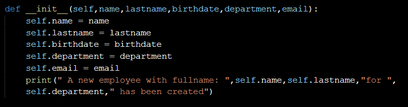
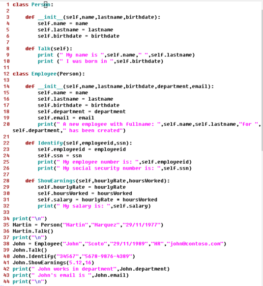
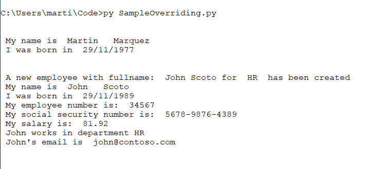

# Understanding method overriding with Python

It is called method overriding to a new definition created within a class, for one or more methods inherited from its superclass. The following example shows how to do it. This example is based on this previous entry: Understanding OOP Inheritance with Python

To override the inherited constructor of the Person class, follow these steps: Enter a new declaration of the constructor method within the Employee class. Add the parameters name,lastname,birthdate,department,email. Within the definition of the constructor add the attributtes self.name, self.lastname,self.birthdate,self.department and self.email then assign the corresponding parameters. Add the following print instruction to the end of the constructor.

Fig 1. Modified constructor

In the main program add two new lines with the following two phrases:

"John works in department"
and concatenate the department attribute of the object John, with a period and
"John's email is "
and concatenate the email attribute of the object John with a period.

Fig 2. Main program

Run the code. As you can see the Jonh instance of the Employee class now accepts three parameters, because the Person constructor has been overriding. In addition, the talk method remains the same inherited from Person.

Fig 3. Running the example

<tt>$ py SampleOverriding.py</tt>

